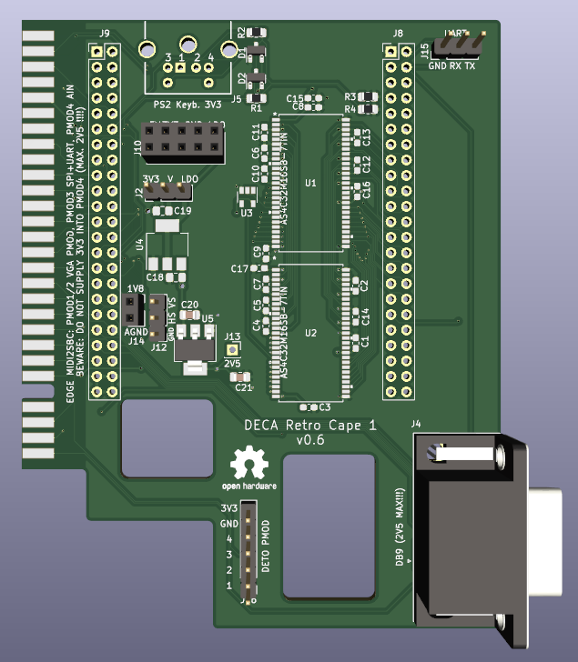
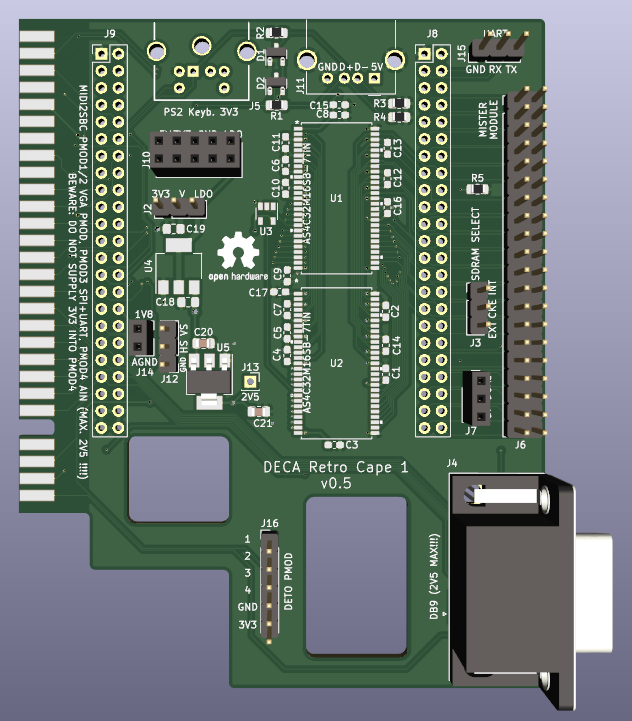
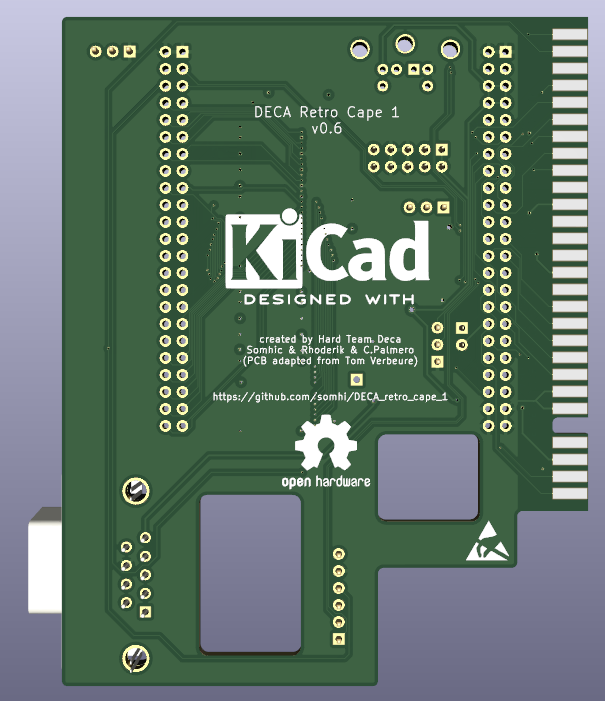

# Arrow DECA Retro Cape 1 (4 layer - embedded SDRAM - Edge connector)

**STATUS (10/03/22):  prototype design work in progress**

Project has been developed with KiCAD 6.0. 

All credits for SDRAM design goes to Tom Verbeure from whom I've taken his [original design  files](https://github.com/tomverbeure/arrow_deca_retro_cape) and adapted to my own design.

As I already developed an Edge to Pmod PCB, I'll be using here attached to the DECA cape. See details at https://github.com/somhi/MIDI_I2S_SBC_Pmod_Edge_Interface

### **Schematic**

 [arrow_deca_retro_cape.pdf](arrow_deca_retro_cape.pdf) 

### **Features**

* 
  

### 3D model

### **Additional notes**

* 
  

### **Jumper Selection**

* 

  

### Changelog

v0.5  routed finalized

v0.6  embedded SDRAM version only. External Mister module removed in order to improve signal integrity.
