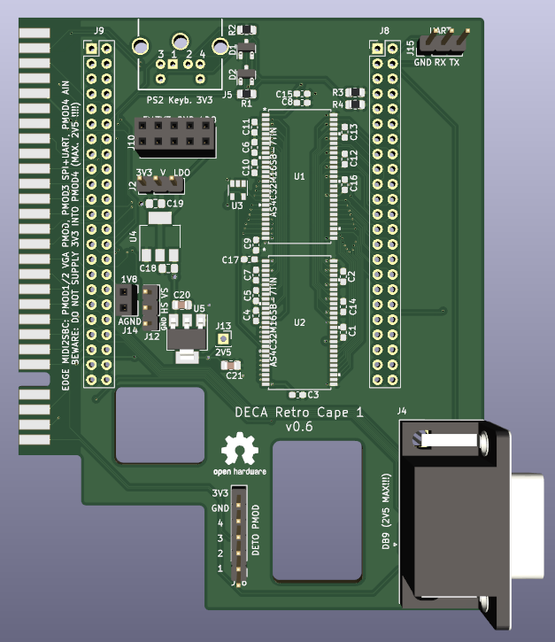

# Arrow DECA Retro Cape

**STATUS (10/03/22):  prototype desing work in progress**

This is my secord PCB design attempt. 

Project has been developed with KiCAD 6.0. 

All credits for SDRAM design goes to Tom Verbeure from whom I've taken his [original design  files](https://github.com/tomverbeure/arrow_deca_retro_cape) and adapted to my own design.

As I already developed an Edge to Pmod PCB, I'll be using here. See details at https://github.com/somhi/MIDI_I2S_SBC_Pmod_Edge_Interface

### **Schematic**

 [arrow_deca_retro_cape.pdf](arrow_deca_retro_cape.pdf) 

### **Features**

* 
  

### 3D model

### **Additional notes**

* 
  

### **Jumper Selection**

* 

  

### Changelog

v0.x
